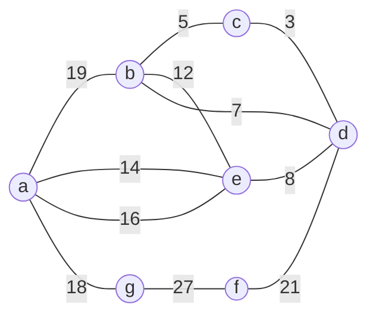
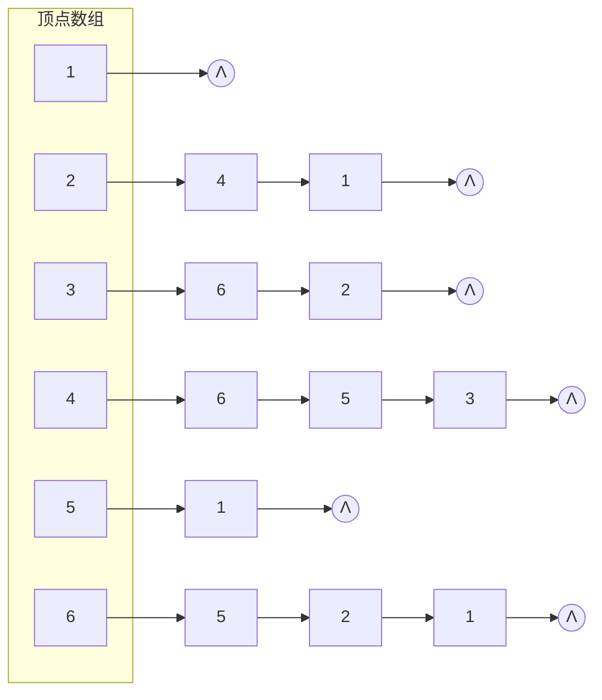

# 数据结构复习题目汇编

---

# 第一部分：排序、散列查找、图、二叉树

---

## 一、单选题（共39题）

### 排序算法

**1. 希尔排序的时间复杂度与以下哪个因素密切相关？**
- A. 待排序序列的初始状态
- B. 增量序列的选择 ✅
- C. 排序算法的稳定性
- D. 辅助空间的大小

> 答案解析：希尔排序的时间复杂度依赖于增量序列的选择，不同的增量序列会导致不同的时间复杂度（如希尔增量的O(n²)、Hibbard增量的O(n^(3/2))等）。

---

**2. 以下哪种排序算法是不稳定的？**
- A. 直接插入排序
- B. 折半插入排序
- C. 希尔排序 ✅
- D. 冒泡排序

> 答案解析：希尔排序会将序列分割成多个子序列进行插入排序，可能导致相同关键字元素的相对位置发生变化，因此是不稳定的。

---

**3. 折半插入排序与直接插入排序相比，主要改进在于？**
- A. 减少了记录的移动次数
- B. 减少了关键码的比较次数 ✅
- C. 提高了排序的稳定性
- D. 降低了空间复杂度

> 答案解析：折半插入排序使用折半查找代替顺序查找来确定插入位置，减少了关键码的比较次数（从O(n)降为O(log₂n)）。

---

**4. 对初始序列（21,25,49,25*,16,08）进行直接插入排序时，设置的监视哨位于以下哪个位置？**
- A. r[1]
- B. r[0] ✅
- C. r[6]
- D. r[5]

> 答案解析：直接插入排序算法中，通常将L.r[0]作为监视哨，用于暂存待插入的记录，简化边界条件判断。

---

**5. 希尔排序的基本思想不包括以下哪一项？**
- A. 将待排序列分割成若干子序列
- B. 对每个子序列进行直接插入排序
- C. 逐步缩小增量直至为1
- D. 直接对整个序列进行快速排序 ✅

> 答案解析：快速排序是另一种排序方法，不属于希尔排序的思想。

---

**6. 以下哪种排序方法是稳定的排序方法？**
- A. 直接插入排序 ✅
- B. 快速排序
- C. 希尔排序
- D. 堆排序

> 答案解析：直接插入排序在排序过程中，当关键字相等时不会改变记录的相对位置，因此是稳定的。

---

**7. 在待排序对象序列已按关键码排好序的情况下，以下哪种排序方法的关键码比较次数更少？**
- A. 直接插入排序 ✅
- B. 折半插入排序
- C. 两者相同
- D. 无法确定

> 答案解析：当待排序序列已按关键码排好序时，直接插入排序每趟只需比较1次，无需移动；而折半插入排序仍需进行⌊log₂i⌋+1次比较。

---

### 散列（哈希）查找

**8. 使用除留余数法构造散列函数，散列表长度为11，关键字序列{23, 14, 9, 6, 30, 12, 18}，则关键字18的散列地址是（ ）**
- A. 7 ✅
- B. 8
- C. 9
- D. 10

> 答案解析：除留余数法公式为H(key)=key mod 11。18 mod 11=7，故散列地址为7。

---

**9. 下列关于散列冲突解决方法的描述中，错误的是（ ）**
- A. 开放定址法的空间利用率较高
- B. 链地址法不会产生聚集现象
- C. 再散列法需要设计多个散列函数
- D. 链地址法的查找效率与冲突次数无关 ✅

> 答案解析：链地址法中，冲突次数越多，链表长度越长，查找效率越低。

---

**10. 在长度为n的顺序表中进行顺序查找，若查找每个元素的概率相等，则平均查找长度为（ ）**
- A. (n+1)/2 ✅
- B. n/2
- C. n
- D. log₂n

> 答案解析：顺序查找时，查找第i个元素需比较i次，平均查找长度为(1+2+...+n)/n=(n+1)/2。

---

**11. 采用除留余数法构造散列函数，散列表长度为11，则对于关键字123，其散列地址是（ ）**
- A. 2 ✅
- B. 3
- C. 4
- D. 5

> 答案解析：123 mod 11 = 123 - 11×11 = 123 - 121 = 2。

---

**12. 以下关于散列冲突解决方法的描述中，错误的是（ ）**
- A. 线性探测法的特点是冲突发生时，顺序查看下一个单元
- B. 二次探测法的探测序列为d_i=1²,-1²,2²,-2²,...
- C. 链地址法将所有散列地址相同的元素链接成一个单链表
- D. 线性探测法不会产生"堆积"现象 ✅

> 答案解析：线性探测法在解决冲突时，会导致后续元素的散列地址被占用，从而产生"堆积"现象。

---

### 图

**13. 在一个具有n个顶点的有向图中，若所有顶点的出度数之和为s，则所有顶点的度数之和为（ ）**
- A. s
- B. s-1
- C. s+1
- D. 2s ✅

> 答案解析：在有向图中，每个顶点的度数等于入度加出度，而所有顶点的入度之和等于出度之和（均为边数）。已知出度数之和为s，则入度数之和也为s，因此总度数之和为2s。

---

**14. 在一个无向图中，若两顶点之间的路径长度为k，则该路径上的顶点数为（ ）**
- A. k
- B. k+1 ✅
- C. k+2
- D. 2k

> 答案解析：路径长度是指路径上经过的边的数目，而路径上的顶点数比边数多1。

---

**15. 若要把n个顶点连接为一个连通图，则至少需要（ ）条边**
- A. n
- B. n+1
- C. n-1 ✅
- D. 2n

> 答案解析：连通图的生成树包含n个顶点和n-1条边，且是极小连通子图。

---

**16. 无向图的邻接矩阵具有以下哪个特性？**
- A. 矩阵对角线元素全为1
- B. 矩阵是对称的 ✅
- C. 第i行1的个数等于顶点i的出度
- D. 矩阵中1的个数等于图的边数

> 答案解析：无向图中边(vi, vj)与(vj, vi)是同一条边，因此邻接矩阵中A[i][j] = A[j][i]，矩阵对称。

---

**17. 若有向图G的邻接矩阵为A，A[i][j]=1表示存在边<i,j>，则顶点i的出度为（ ）**
- A. 第i行中1的个数 ✅
- B. 第i列中1的个数
- C. 第i行和第i列中1的个数之和
- D. 以上都不对

> 答案解析：有向图邻接矩阵中，第i行的元素表示从顶点i出发的边，因此第i行中1的个数为顶点i的出度。

---

### 二叉树

**18. 二叉树中第k层最多有多少个节点？**
- A. k
- B. 2^k
- C. 2^(k-1) ✅
- D. k²

> 答案解析：二叉树第k层节点数最大值为2^(k-1)（k≥1）。

---

**19. 树中节点的度是指？**
- A. 节点所在的层次
- B. 节点拥有的子节点数目 ✅
- C. 节点到根的路径长度
- D. 节点的深度

> 答案解析：节点的度定义为其拥有的子节点（直接后继）的数量。

---

**20. 哈夫曼树主要用于以下哪个领域？**
- A. 数据加密
- B. 数据压缩 ✅
- C. 排序算法
- D. 图形处理

> 答案解析：哈夫曼树构造的哈夫曼编码可实现最优前缀编码，用于数据压缩。

---

**21. 以下关于树的描述中，错误的是（ ）**
- A. 树是n(n≥0)个结点的有限集，n=0时为空树
- B. 非空树中有且仅有一个根结点，其余结点可分为m(m>0)个互不相交的子树
- C. 树的度是指树中所有结点度的平均值 ✅
- D. 树的深度是指树中所有结点的最大层数

> 答案解析：树的度是指树中所有结点度的最大值，而非平均值。

---

**22. 在一棵具有n个结点的二叉树中，若度为0的结点数为n₀，度为1的结点数为n₁，度为2的结点数为n₂，则下列关系式正确的是（ ）**
- A. n₀ = n₂ + 1 ✅
- B. n₀ = n₁ + 1
- C. n₁ = n₂ + 1
- D. n₂ = n₀ + 1

> 答案解析：根据二叉树的性质，度为0的结点数（叶子结点数）等于度为2的结点数加1，即n₀ = n₂ + 1。

---

**23. 图中，_____都是完全二叉树。**
- A. 1、2、4 ✅
- B. 1、2、3
- C. 2、3、4
- D. 1、3、4

---

**24. 按照树的定义，具有3个结点的树有（）种形态。**
- A. 2 ✅
- B. 3
- C. 4
- D. 5

---

**25. 设一棵二叉树有2n个结点，则不可能存在（）的结点。**
- A. n个度为0
- B. 偶数个度为0
- C. 偶数个度为2
- D. 偶数个度为1 ✅

> 答案解析：因为n₀ = n₂ + 1，又n₀ + n₁ + n₂ = 2n，所以2n₂ + 1 + n₁ = 2n。所以n₁一定为奇数。

---

**26. 已知一棵完全二叉树的第6层（设根为第1层）有8个叶结点，则该完全二叉树的节点个数最少为（）。**
- A. 119
- B. 111
- C. 52
- D. 39 ✅

> 答案解析：前五层的个数为1+2+4+8+16=31。第六层有8个叶结点，所以结点个数为39。

---

**27. 在一棵二叉树中有两个结点x和y，在该二叉树的先序遍历序列中x在y之前，在其后序遍历序列中x在y之后，则x和y的关系是（）。**
- A. x是y的左兄弟
- B. x是y的右兄弟
- C. x是y的子孙
- D. x是y的祖先 ✅

---

**28. 已知一棵二叉树的前序遍历结果为ABCDEF，中序遍历结果为CBAEDF，则后序遍历的结果为（）。**
- A. CBEFDA ✅
- B. FEDCBA
- C. CBEDFA
- D. 不定

---

**29. 二叉树是非线性数据结构，所以（）。**
- A. 它不能用顺序存储结构存储
- B. 它不能用链式存储结构存储
- C. 顺序存储结构和链式存储结构都能存储 ✅
- D. 顺序存储结构和链式存储结构都不能使用

> 答案解析：完全二叉树（包括满二叉树）使用顺序存储，普通二叉树一般用二叉链表或者三叉链表存储。

---

**30. 将一棵有100个结点的完全二叉树从根这一层开始，每一层上从左到右依次对结点进行编号，根结点的编号为1，则编号为49的结点的左孩子编号为（）。**
- A. 99
- B. 98 ✅
- C. 50
- D. 48

---

**31. 设给定权值总数有n 个，其哈夫曼树的结点总数为（）。**
- A. 2n
- B. 2n+1
- C. 2n-1 ✅
- D. 不确定

> 答案解析：哈夫曼树中只有度为0和2的节点，且有n₀ = n₂ + 1。叶子节点有n个，则度为2的节点个数为n-1，总结点个数为n+(n-1)=2n-1。

---

**32. 由3个结点可以构造出多少种不同的二叉树？**
- A. 2
- B. 3
- C. 4
- D. 5 ✅

---

**33. 深度为h的满m叉树的第k层有( )个结点。(1≤k≤h)**
- A. m^(k-1) ✅
- B. m^k - 1
- C. m^(h-1)
- D. m^h - 1

> 答案解析：深度为h的满m叉树共有m^h-1个结点，第k层有m^(k-1)个结点。

---

**34. 对二叉树的结点从1开始进行连续编号，要求每个结点的编号大于其左、右孩子的编号，同一结点的左右孩子中，其左孩子的编号小于其右孩子的编号，可采用( )遍历实现编号。**
- A. 先序
- B. 中序
- C. 后序 ✅
- D. 从根开始按层次遍历

> 答案解析：根据题意可知按照先左孩子、再右孩子、最后双亲结点的顺序遍历二叉树，即后序遍历二叉树。

---

**35. 设哈夫曼树中有199个结点，则该哈夫曼树中有( )个叶子结点。**
- A. 99
- B. 100 ✅
- C. 101
- D. 102

> 答案解析：在哈夫曼树中没有度为1的结点，只有度为0和度为2的结点。由n = n₀ + n₂ = 2n₀ - 1，得n₀ = 100。

---

**36. 树最适合用来表示( )。**
- A. 有序数据元素
- B. 无序数据元素
- C. 元素之间具有分支层次关系的数据 ✅
- D. 元素之间无联系的数据

---

**37. 用5个权值{3, 2, 4, 5, 1}构造的哈夫曼(Huffman)树的带权路径长度是( )。**
- A. 32
- B. 33 ✅
- C. 34
- D. 35

---

**38. 有关二叉树下列说法正确的是( )。**
- A. 一棵二叉树的度可以小于2 ✅
- B. 二叉树的度为2
- C. 二叉树中至少有一个结点的度为2
- D. 二叉树中任何一个结点的度都为2

---

**39. 下述编码中哪一个不是前缀码( )。**
- A. (00, 01, 10, 11)
- B. (0, 10, 110, 111)
- C. (0, 1, 00, 11) ✅
- D. (1, 01, 000, 001)

---

## 二、判断题（共39题）

### 排序算法

**40. 直接插入排序是稳定的排序算法。**
- ✅ 对

> 答案解析：直接插入排序中，当待插入元素的关键字与有序子序列中的元素关键字相等时，会将待插入元素插入到相等元素的后面，不会改变它们的相对位置。

---

**41. 折半插入排序是不稳定的排序算法。**
- ❌ 错（折半插入排序是稳定的）

> 答案解析：折半插入排序中，当待插入元素的关键字与有序子序列中的元素关键字相等时，会将待插入元素插入到相等元素的后面，不会改变它们的相对位置，因此是稳定的。

---

**42. 希尔排序是稳定的排序算法。**
- ❌ 错（希尔排序是不稳定的）

> 答案解析：希尔排序会将序列分割成多个子序列进行插入排序，相同关键字的元素可能被分到不同的子序列中，导致它们的相对位置发生变化，因此是不稳定的。

---

**43. 直接插入排序的时间复杂度在最好情况下为O(n)。**
- ✅ 对

> 答案解析：当待排序序列已经有序时，直接插入排序每趟只需比较1次，总比较次数为n-1，移动次数为0，因此时间复杂度为O(n)。

---

**44. 直接插入排序是一种稳定的排序方法。**
- ✅ 对

---

### 查找

**45. 静态查找表在查找过程中不允许对表进行插入或删除操作。**
- ✅ 对

> 答案解析：静态查找表的定义是查找时不修改表结构（如插入、删除）。

---

**46. 折半查找仅适用于顺序存储的有序表。**
- ✅ 对

> 答案解析：折半查找需要随机访问元素，且表必须有序，因此仅适用于顺序存储的有序表。

---

**47. 二叉排序树的中序遍历序列是递增有序的。**
- ✅ 对

> 答案解析：二叉排序树的定义是左子树节点值小于根节点，右子树节点值大于根节点，中序遍历按左根右顺序，因此序列递增有序。

---

**48. 散列函数的冲突是可以完全避免的。**
- ❌ 错

> 答案解析：由于关键字集合大小通常远大于散列表长度，根据鸽巢原理，冲突无法完全避免。

---

**49. 除留余数法中，散列表长度m最好取质数。**
- ✅ 对

> 答案解析：取质数作为m可减少冲突，因为质数的因子少，分布更均匀。

---

**50. 顺序查找的时间复杂度为O(n)，与表的有序性无关。**
- ✅ 对

> 答案解析：顺序查找需逐个比较元素，无论表是否有序，时间复杂度均为O(n)。

---

**51. 顺序查找中设置哨兵的目的是为了减少比较次数，提高查找效率。**
- ✅ 对

> 答案解析：设置哨兵后，查找时不需要每次都判断是否越界，只需从后往前比较直到找到哨兵，减少了一次条件判断。

---

**52. 折半查找适用于所有线性表的查找。**
- ❌ 错

> 答案解析：折半查找仅适用于有序的顺序表，对于无序表或链表结构不适用。

---

### 图

**53. 有向图中仅1个顶点的入度为0，其余顶点的入度均为1时，该图一定是一棵有向树。**
- ✅ 对

> 答案解析：有向树的定义为：有一个顶点入度为0（根），其余顶点入度为1，且从根到每个顶点有唯一路径。

---

**54. 生成树是包含图中所有顶点的极小连通子图，因此生成树中边的数目为顶点数减1。**
- ✅ 对

> 答案解析：生成树的定义包含三个条件：连通子图、包含所有顶点、无回路。根据树的性质，n个顶点的树有n-1条边。

---

**55. 邻接表表示法中，无向图的边表节点数是边数的2倍。**
- ✅ 对

> 答案解析：无向图中每条边(vi, vj)在邻接表中会被存储两次。

---

**56. 图的深度优先遍历序列一定唯一。**
- ❌ 错

> 答案解析：图的遍历序列与顶点的访问顺序有关，邻接表中顶点的存储顺序不同，遍历序列可能不同。

---

**57. 无向图的邻接表中，边结点的总数是图中边数的2倍。**
- ✅ 对

---

**58. 广度优先搜索生成的树一定是最小生成树。**
- ❌ 错

> 答案解析：广度优先搜索生成的是广度优先生成树，其边数为n-1，但边的权重不一定是最小的。最小生成树需要通过Prim或Kruskal算法构造。

---

**59. 若有向图中存在环，则该图不存在拓扑序列。**
- ✅ 对

> 答案解析：拓扑序列要求所有边的起点在终点之前，而环中存在循环依赖，无法满足这一条件。

---

**60. 有向图中所有顶点的入度之和等于所有顶点的出度之和。**
- ✅ 对

> 答案解析：每条有向边贡献一个入度和一个出度，因此所有顶点的入度之和等于出度之和，且等于图中边的总数。

---

### 二叉树

**61. 二叉树的左子树和右子树可以随意互换位置。**
- ❌ 错

> 答案解析：二叉树是有序树，左右子树位置不可互换。

---

**62. 树的深度等于树中节点的最大层次数。**
- ✅ 对

---

**63. 任何一棵普通树都可以唯一转换为一棵二叉树。**
- ✅ 对

> 答案解析：通过左孩子右兄弟转换法可唯一将普通树转为二叉树。

---

**64. 叶节点的度为0。**
- ✅ 对

> 答案解析：叶节点无直接后继，故度为0。

---

**65. 完全二叉树一定是满二叉树。**
- ❌ 错

> 答案解析：满二叉树一定是完全二叉树，但完全二叉树不一定是满二叉树。

---

**66. 哈夫曼树中没有度为1的结点。**
- ✅ 对

> 答案解析：哈夫曼树的构造过程是每次选取两个权值最小的结点作为左右孩子构造新的结点，因此哈夫曼树中所有结点的度要么是0要么是2。

---

**67. 只有一棵子树的二叉树不需要区分左右子树。**
- ❌ 错

> 答案解析：即使只有一棵子树，二叉树也必须区分左右子树。

---

**68. 二叉树中每个结点的两棵子树的高度差等于1。**
- ❌ 错

> 答案解析：高度差不一定等于1，也可以很大（这是平衡二叉树的特性，不是普通二叉树的特性）。

---

**69. 二叉树中每个结点的两棵子树是有序的。**
- ✅ 对

---

**70. 二叉树用二叉链表作存储结构，则在n个结点的二叉树链表中只有n+1个空指针域。**
- ✅ 对

---

**71. 二叉树中每个结点至多有两棵非空子树。**
- ✅ 对

---

**72. 具有12个结点的完全二叉树有5个度为2的结点。**
- ✅ 对

> 答案解析：二叉树中，叶子结点的数量比度为二的结点的数量多1。完全二叉树度为1的结点至多为1。

---

**73. 二叉树的遍历结果不是唯一的。**
- ✅ 对

> 答案解析：前序遍历、中序遍历和后序遍历结果不一样。

---

**74. 对一棵二叉树进行层次遍历时，应借助于一个栈。**
- ❌ 错

> 答案解析：对一棵二叉树进行层次遍历时，应借助于一个**队列**。

---

**75. 完全二叉树中，若一个结点没有左孩子，则它必是树叶。**
- ✅ 对

> 答案解析：在完全二叉树中，没有左孩子也就不会有右孩子，所以它必是树叶。

---

**76. 二叉树中每个结点至多有两个子结点，而对一般树则无此限制。因此，二叉树是树的特殊情形。**
- ❌ 错

> 答案解析：树和二叉树是两种不同的树形结构，二叉树不是树的特殊形式。二叉树的子树有左右之分，其次序不能任意颠倒。

---

**77. 由二叉树的前序和后序遍历序列能唯一确定这棵二叉树。**
- ❌ 错

> 答案解析：由二叉树的前序和后序遍历序列不能唯一确定这棵二叉树。需要前序+中序或后序+中序。

---

**78. 不含任何结点的空树是一棵树也是一棵二叉树。**
- ✅ 对

---

## 三、简答题（共11题）

### 79. 简述直接插入排序的基本思想和算法步骤。

**参考答案：**

**基本思想：** 将待排序序列分为有序子序列和无序子序列，每次从无序子序列中取出一个元素，插入到有序子序列的适当位置，直到整个序列有序。

**算法步骤：**
1. 将序列的第一个元素视为有序子序列；
2. 从第二个元素开始，依次将每个元素插入到前面的有序子序列中；
3. 插入时，从有序子序列的末尾向前比较，找到插入位置后，将该位置及其后面的元素后移，再将当前元素插入到该位置；
4. 重复步骤2-3，直到所有元素插入完毕。

---

### 80. 已知待排序序列为 [46, 79, 56, 38, 40, 84]：

**（1）将该序列构建成初始大根堆，请写出堆的列表表示形式。**

✅ **[84, 79, 56, 38, 40, 46]**

**（2）写出堆排序第一趟输出堆顶元素并调整后的结果。**

✅ **[79, 46, 56, 38, 40]**

（注：输出堆顶84后，将末尾46移至堆顶并向下过滤调整）

**（3）堆排序属于哪种排序类别？其时间复杂度是多少？**

✅ 选择排序，时间复杂度 O(nlog₂n)

---

### 81. 简述顺序查找的优缺点及适用场景。

**参考答案：**

- **优点：** 算法简单，对表结构无要求（顺序或链式均可），适用于无序表或小表。
- **缺点：** n很大时效率低，时间复杂度O(n)。
- **适用场景：** 表规模小、无序或频繁插入删除的场景。

---

### 82. 简述二叉排序树中删除节点的三种情况及处理方法。

**参考答案：**

1. **节点为叶子（度为0）：** 直接删除，修改父节点指针。
2. **节点有一个子树（度为1）：** 子树替代该节点，修改父节点指针。
3. **节点有两个子树（度为2）：** 用左子树最大节点或右子树最小节点替代，再删除该替代节点。

---

### 83. 比较开放定址法和链地址法解决散列冲突的优缺点。

**参考答案：**

| 方法 | 优点 | 缺点 |
|------|------|------|
| 开放定址法 | 空间利用率高，无需额外指针 | 易产生聚集，删除困难 |
| 链地址法 | 无聚集，删除简单，冲突处理灵活 | 需额外存储空间存储指针，空间利用率低 |

---

### 84. 简述线性探测法解决散列冲突的过程，并说明其缺点。

**参考答案：**

- **过程：** 当冲突发生时，依次检查下一个地址（H(key)+i）mod m，直到找到空地址。
- **缺点：** 容易产生"二次聚集"（堆积），即冲突点附近的地址也容易冲突，导致查找效率下降。

---

### 85. 比较顺序查找、折半查找、二叉排序树查找的优缺点及适用场景。

**参考答案：**

| 查找方法 | 优点 | 缺点 | 适用场景 |
|----------|------|------|----------|
| 顺序查找 | 简单、无结构要求 | 效率低 O(n) | 小表或无序表 |
| 折半查找 | 效率高 O(log₂n) | 需有序顺序表 | 有序大表 |
| 二叉排序树查找 | 动态维护、平均O(log₂n) | 最坏O(n) | 动态变化的表 |

---

### 86. 简述线性探测法和链地址法解决散列冲突的基本思想，并比较两者的优缺点。

**参考答案：**

- **线性探测法：** 冲突发生时，顺序查看下一个单元，直到找到空单元插入。
  - 优点：实现简单
  - 缺点：易产生堆积现象，查找效率降低
- **链地址法：** 将散列地址相同的元素链接成单链表。
  - 优点：不会产生堆积，删除方便
  - 缺点：需额外空间存储指针

---

### 87. 请比较邻接矩阵和邻接表两种存储结构的优缺点。

**参考答案：**

| 存储结构 | 优点 | 缺点 |
|----------|------|------|
| 邻接矩阵 | 判断两顶点间是否有边快（O(1)）、计算顶点度快 | 空间复杂度高（O(n²)）、不适合稀疏图 |
| 邻接表 | 空间复杂度低（O(n+e)）、适合稀疏图 | 判断两边慢（需遍历边表，O(d)）、计算有向图入度慢 |

---

### 88. 简述二叉树的两种主要存储结构（顺序存储结构和链式存储结构）的优缺点。

**参考答案：**

**顺序存储结构：**
- 优点：存储密度高，节省存储空间；可以快速访问任意结点（通过索引）
- 缺点：只适合存储完全二叉树，对于一般二叉树会浪费大量存储空间；插入和删除结点时需要移动大量元素

**链式存储结构：**
- 优点：适合存储任意二叉树，不会浪费存储空间；插入和删除结点时只需修改指针
- 缺点：存储密度低，每个结点需要额外存储指针域；访问任意结点需要遍历

---

### 89. 使用克鲁斯卡尔（Kruskal）算法构造最小生成树，写出每一步选择的边及其权值。

> 网G如下图所示：



**参考答案（按顺序）：**

| 步骤 | 边 | 权值 |
|------|-----|------|
| 1 | (c, d) | 3 |
| 2 | (c, b) | 5 |
| 3 | (e, d) | 8 |
| 4 | (e, a) | 14 |
| 5 | (e, g) | 16 |
| 6 | (d, f) | 21 |

---

## 四、填空题（共9题）

**90. 已知图的邻接表，分别给出用深度优先搜索和广度优先搜索从顶点3出发的遍历序列。**

> 邻接表结构如下图所示：



> 邻接表文字描述：
> - 顶点1：无邻接点 → Λ
> - 顶点2：→ 4 → 1 → Λ
> - 顶点3：→ 6 → 2 → Λ
> - 顶点4：→ 6 → 5 → 3 → Λ
> - 顶点5：→ 1 → Λ
> - 顶点6：→ 5 → 2 → 1 → Λ

- (1) 深度优先遍历序列: **3, 6, 5, 1, 2, 4**
- (2) 广度优先遍历序列: **3, 6, 2, 5, 1, 4**

---

**91. 设一棵二叉树的后序是FDBAGHEC，中序序列是BFDAGEHC，则其先序序列是____。**

✅ **CEGABDFH**

---

**92. 假设每个节点值为单个字符，而一棵树的后根遍历序列为ABCDEFGHIJ，则其根节点值是____。**

✅ **J**

---

**93. 按照二叉树的定义，具有3个节点的二叉树有____种。**

✅ **5**

---

**94. 一棵完全二叉树中有1000个节点，其中度为1的节点个数是____。**

✅ **1**

> 解析：完全二叉树中节点个数n为奇数时，n₁=0；n为偶数时，n₁=1。

---

**95. 一棵完全二叉树中有501个叶子节点，则至少有____个节点。**

✅ **1001**

> 解析：n₀ = n₂ + 1，n₀ = 501，n₂ = 500，n = n₀ + n₁ + n₂ = 1001 + n₁，n₁为0或1，所以n ≥ 1001。

---

**96. 一棵二叉树的先序遍历序列为ABCDEF，中序遍历序列为CBAEDF，则后序遍历序列为____。**

✅ **CBEFDA**

---

**97. 一棵二叉树中，叶子的个数为10，则其度为2的结点的个数为____。**

✅ **9**

> 解析：n₀ = n₂ + 1，所以 n₂ = n₀ - 1 = 9。

---

**98. 若一棵二叉树具有10个度为2的结点，5个度为1的结点，则度为0的结点个数是____。**

✅ **11**

> 解析：n₀ = n₂ + 1 = 10 + 1 = 11。

---

## 五、简答题（填空）（共1题）

**99. 已知某二叉树的后序序列是GEFCDBA，中序序列是AEGCFBD，则：**

- (1) 先序遍历序列是: **ABCEGFD**
- (2) **A** 是根
- (3) B是A的 **右** 孩子
- (4) B的左右孩子分别是 **C** 和 **D**
- (5) C的度是 **2**

---

## 六、算法设计题（填空）（共1题）

**100. 二分查找算法实现：**

```python
def binarySearch(arr, x):
    low = 0
    high = len(arr) - 1
    while low <= high:
        mid = (low + high) // 2          # 空1
        if x == arr[mid]:
            return mid
        elif x > arr[mid]:               # 空2
            low = mid + 1                # 空3
        else:
            high = mid - 1               # 空4
    return -1                            # 空5
```

**在数组{5, 13, 19, 27, 33, 41, 56, 68, 74, 89}中查找关键字56时需要比较的次数是: 4次**

> 过程：mid=4(33)→33<56, low=5; mid=7(68)→68>56, high=6; mid=5(41)→41<56, low=6; mid=6(56) 成功。

---

---

# 第二部分：数据结构基础、线性表、栈和队列

---

## 一、单选题（共39题）

### 数据结构基础

**1. 从存储结构上可以把数据结构分成（）。**
- A. 顺序结构和链式结构 ✅
- B. 紧凑结构和非紧凑结构
- C. 内部结构和外部结构
- D. 线性结构和非线性结构

---

**2. 在存储数据时，通常不仅需要存储数据元素的值，还要存储（）。**
- A. 数据元素的类型
- B. 数据的基本运算
- C. 数据元素之间的关系 ✅
- D. 数据的存取方式

---

**3. 以下关于数据元素之间关系的说法中错误的是（）。**
- A. 线性结构中结点形成一对一的关系
- B. 树形结构具有分支和层次的特点
- C. 图形结构中的元素按其逻辑关系互相连接
- D. 集合结构中的元素在逻辑上都有联系，但组织形式松散 ✅

---

**4. 评价一个算法性能好坏的最重要标准是（ ）。**
- A. 算法的正确性
- B. 算法的鲁棒性
- C. 算法的可读性
- D. 算法的时间复杂度和空间复杂度 ✅

---

**5. 算法的时间复杂度与（ ）有关。**
- A. 问题规模 ✅
- B. 计算机硬件性能
- C. 程序设计语言
- D. 编译程序质量

---

**6. 以下关于数据结构说法正确的是( )。**
- A. 数据的逻辑结构独立于其存储结构 ✅
- B. 数据的存储结构独立于其逻辑结构
- C. 数据的逻辑结构唯一决定了其存储结构
- D. 数据结构仅由逻辑结构和存储结构决定

> 解析：数据结构包含三要素：逻辑结构、存储结构和数据运算。

---

**7. 下述( )与数据的存储结构无关。**
- A. 栈 ✅
- B. 双向链表
- C. 循环队列
- D. 线索树

> 解析：栈可以是顺序栈或链栈实现，所以是逻辑结构；其他选项都确定使用某种存储结构。

---

**8. 可以用( )来定义一个完整的数据结构。**
- A. 数据元素
- B. 数据对象
- C. 数据关系
- D. 抽象数据类型 ✅

> 解析：抽象数据类型ADT描述了数据的逻辑结构和抽象运算，通常用(数据对象，数据关系，基本操作集)三元组来表示。

---

**9. 在数据结构中，从逻辑上可以把数据结构分成( )。**
- A. 动态结构和静态结构
- B. 紧凑结构和非紧凑结构
- C. 线性结构和非线性结构 ✅
- D. 内部结构和外部结构

---

**10. 以下数据结构中，( )是非线性数据结构**
- A. 树 ✅
- B. 字符串
- C. 队列
- D. 栈

---

### 线性表

**11. 若线性表最常用的操作是存取第i个元素及其前驱和后继元素的值，为了提高效率，应采用( )的存储方式。**
- A. 单链表
- B. 双向链表
- C. 单循环链表
- D. 顺序表 ✅

> 解析：顺序表可以随机存取，时间复杂度为O(1)。

---

**12. 在一个长度为n的顺序表中删除第i个元素(1≤i≤n)，需向前移动( )个元素。**
- A. n
- B. i - 1
- C. n - i ✅
- D. n - i + 1

> 解析：需要将第i+1个到第n个都往前移动一位，需要移动n-(i+1)+1 = n-i个。

---

**13. 对于顺序表，访问第i个位置的元素和在第i个位置插入一个元素的时间复杂度为( )。**
- A. O(n)，O(n)
- B. O(n)，O(1)
- C. O(1)，O(n) ✅
- D. O(1)，O(1)

---

**14. 对于顺序存储的线性表，其算法的时间复杂度为O(1)的运算应该是( )**
- A. 将n个元素从小到大排序
- B. 删除第i个元素(1≤i≤n)
- C. 改变第i个元素的值(1≤i≤n) ✅
- D. 在第i个元素后插入一个新元素(1≤i≤n)

---

**15. 单链表中，增加一个头结点的目的是为了( )。**
- A. 使单链表至少有一个结点
- B. 标识表结点中首结点位置
- C. 方便运算的实现 ✅
- D. 说明单链表是线性表的链式存储

---

**16. 某线性表中最常见的操作是在最后一个元素之后插入一个元素和删除第一个元素，则采用( )存储方式最省时间。**
- A. 单链表
- B. 仅有头指针的单循环链表
- C. 双链表
- D. 仅有尾指针的单循环链表 ✅

---

**17. 与单链表相比，双链表的优点在于( )。**
- A. 插入、删除操作更方便
- B. 可以进行随机访问
- C. 可以省略表头指针或表尾指针
- D. 访问前后相邻结点更灵活 ✅

---

**18. 若某线性表最常用的操作是存取任一指定序号的元素和在最后进行插入和删除运算，则利用( )存储方式最节省时间。**
- A. 顺序表 ✅
- B. 双链表
- C. 带头结点的双循环链表
- D. 单循环链表

---

**19. 顺序表中第一个元素的存储地址是100，每个元素的长度为2，则第5个元素的地址是( )。**
- A. 110
- B. 108 ✅
- C. 100
- D. 120

> 解析：顺序表中的数据连续存储，第5个元素的地址为：100 + 2×4 = 108。

---

**20. 向一个有127个元素的顺序表中插入一个新元素并保持原来顺序不变，平均要移动的元素个数为( )。**
- A. 8
- B. 63.5 ✅
- C. 63
- D. 7

> 解析：平均要移动的元素个数为 n/2 = 127/2 = 63.5。

---

**21. 链接存储的存储结构所占存储空间( )。**
- A. 分两部分，一部分存放结点值，另一部分存放表示结点间关系的指针 ✅
- B. 只有一部分，存放结点值
- C. 只有一部分，存储表示结点间关系的指针
- D. 分两部分，一部分存放结点值，另一部分存放结点所占单元数

---

**22. 线性表L在( )情况下适用于使用链式结构实现。**
- A. 需经常修改L中的结点值
- B. 需不断对L进行删除插入 ✅
- C. L中含有大量的结点
- D. L中结点结构复杂

> 解析：链表最大的优点在于插入和删除时不需要移动数据，直接修改指针即可。

---

**23. 单链表的存储密度( )。**
- A. 大于1
- B. 等于1
- C. 小于1 ✅
- D. 不能确定

> 解析：存储密度 = 数据本身所占空间 / 结点总空间 = D/(D+N) < 1。

---

**24. 线性表L=(a₁, a₂, …… aₙ)，下列说法正确的是( )。**
- A. 每个元素都有一个直接前驱和一个直接后继
- B. 线性表中至少有一个元素
- C. 表中诸元素的排列必须是由小到大或由大到小
- D. 除第一个和最后一个元素外，其余每个元素都有一个且仅有一个直接前驱和直接后继 ✅

---

**25. 在一个长度为n的顺序表中，在第i个元素(1≤i≤n+1)之前插入一个新元素时须向后移动( )个元素。**
- A. n - i
- B. n - i + 1 ✅
- C. n - i - 1
- D. i

---

**26. 将两个各有n个元素的有序表归并成一个有序表，其最少的比较次数是( )。**
- A. n ✅
- B. 2n - 1
- C. 2n
- D. n - 1

> 解析：当第一个有序表中所有的元素都小于（或大于）第二个表中的元素，只需要用第二个表中的第一个元素依次与第一个表的元素比较，总计比较n次。

---

### 栈和队列

**27. 数组q[M]存储一个循环队，first和last分别是首尾指针，如果使元素x进队操作的语句为"q[last]=x, last=(last+1)%m;"那么判断队满的条件是____。**
- A. last == M-1
- B. last == first
- C. (last+1)%m == first ✅
- D. last+1 == first

---

**28. 若让元素1，2，3，4，5依次进栈，则出栈次序不可能出现( )种情况。**
- A. 5，4，3，2，1
- B. 2，1，5，4，3
- C. 4，3，1，2，5 ✅
- D. 2，3，5，4，1

> 解析：C选项中元素1比元素2先出栈，违背了栈的后进先出原则。

---

**29. 若已知一个栈的入栈序列是1，2，3，…，n，其输出序列为p₁，p₂，p₃，…，pₙ，若p₁=n，则pᵢ为( )。**
- A. i
- B. n - i
- C. n - i + 1 ✅
- D. 不确定

> 解析：p₁=n说明全部一次性进栈再输出，所以pᵢ = n - i + 1。

---

**30. 栈在( )中有所应用。**
- A. 递归调用
- B. 函数调用
- C. 表达式求值
- D. 前三个选项都有 ✅

---

**31. 为解决计算机主机与打印机间速度不匹配问题，通常设一个打印数据缓冲区。该缓冲区的逻辑结构应该是( )。**
- A. 队列 ✅
- B. 栈
- C. 线性表
- D. 有序表

> 解析：解决缓冲区问题应利用先进先出的线性表——队列。

---

**32. 设栈S和队列Q的初始状态为空，元素e1、e2、e3、e4、e5和e6依次进入栈S，一个元素出栈后即进入Q，若6个元素出队的序列是e2、e4、e3、e6、e5和e1，则栈S的容量至少应该是( )。**
- A. 2
- B. 3 ✅
- C. 4
- D. 6

---

**33. 设计一个判别表达式中左，右括号是否配对出现的算法，采用( )数据结构最佳。**
- A. 线性表的顺序存储结构
- B. 队列
- C. 线性表的链式存储结构
- D. 栈 ✅

---

**34. 用链接方式存储的队列，在进行删除运算时( )。**
- A. 仅修改头指针
- B. 仅修改尾指针
- C. 头、尾指针都要修改
- D. 头、尾指针可能都要修改 ✅

> 解析：一般情况下只修改头指针，但当删除的是队列中最后一个元素时，队尾指针也丢失了，因此需对队尾指针重新赋值。

---

**35. 循环队列存储在数组A[0..m]中，则入队时的操作为( )。**
- A. rear = rear + 1
- B. rear = (rear + 1) % (m - 1)
- C. rear = (rear + 1) % m
- D. rear = (rear + 1) % (m + 1) ✅

> 解析：数组A[0..m]中共含有m+1个元素，故在求模运算时应除以m+1。

---

**36. 最大容量为n的循环队列，队尾指针是rear，队头是front，则队空的条件是( )。**
- A. (rear+1)%n == front
- B. rear == front ✅
- C. rear+1 == front
- D. (rear-1)%n == front

---

**37. 栈和队列的共同点是( )。**
- A. 都是先进先出
- B. 都是先进后出
- C. 只允许在端点处插入和删除元素 ✅
- D. 没有共同点

---

**38. 一个递归算法必须包括( )。**
- A. 递归部分
- B. 终止条件和递归部分 ✅
- C. 迭代部分
- D. 终止条件和迭代部分

---

**39. 有六个元素6，5，4，3，2，1顺序入栈，下列哪一个不是合法的出栈序列？**
- A. 543621
- B. 453126
- C. 346521 ✅
- D. 234156

---

## 二、判断题（共25题）

### 数据结构基础

**40. 数据元素是数据的最小单元。**
- ❌ 错

> 解析：数据元素是数据的基本单元，一个数据元素由若干数据项组成。数据项才是数据的最小单元。

---

**41. 健壮的算法不会因为非法输入而出现莫名其妙的状态。**
- ✅ 对

---

**42. 数据结构的抽象操作的定义与具体实现无关。**
- ✅ 对

---

**43. 数据项是数据处理的最小单位。**
- ✅ 对

---

**44. 数据的逻辑结构分为集合、线性结构、层次结构和图形结构4种基本类型。**
- ❌ 错

> 解析：数据的逻辑结构分为：集合结构、线性结构、树形结构（层次结构）和图形结构。但要注意——"层次结构"应表述为"树形结构"。

---

**45. 数据的逻辑结构与各数据元素在计算机中如何存储有关。**
- ❌ 错

> 解析：逻辑结构独立于存储结构。

---

**46. 数据的逻辑结构是指数据的各项数据项之间的逻辑关系。**
- ❌ 错

> 解析：数据的逻辑结构是指数据**元素**之间的逻辑关系，而非数据项之间。

---

**47. 基于某种逻辑结构之上的运算，其实现是唯一的。**
- ❌ 错

> 解析：同一逻辑结构可以有多种不同的实现方式（如顺序存储和链式存储）。

---

**48. 在数据结构中，数据项和数据元素是数据的基本单位。**
- ❌ 错

> 解析：数据元素是数据的基本单位，数据项是数据的最小单位。

---

**49. 数据的不可分割的最小标识单位是数据项，它通常不具有完整确定的实际意义，或不被当作一个整体对待。**
- ✅ 对

---

### 线性表

**50. 线性表的特点是每个元素都有一个前驱和一个后继。**
- ❌ 错

> 解析：除第一个元素无前驱、最后一个元素无后继外，其余每个元素都有一个直接前驱和一个直接后继。

---

**51. 顺序存储的线性表可以按序号随机存取。**
- ✅ 对

---

**52. 链表中的头结点仅起到标识作用。**
- ❌ 错

> 解析：头结点还有方便运算实现的作用（如使空表和非空表处理统一）。

---

**53. 在单链表中和在顺序表中插入一个元素，其时间复杂度均为O(n)，因此说它们的执行时间是相等的。**
- ❌ 错

> 解析：大O记法表示时间渐近复杂度，虽然两种存储结构下的插入操作时间复杂度均为O(n)，但两者的基本操作不同（一个是移动元素，一个是指针操作），因此不能说执行时间相等。

---

**54. 取线性表的第i个元素的时间同i的大小有关。**
- ❌ 错

> 解析：存取线性表中数据元素的时间开销与其存储结构有关，顺序存储结构具有按序号随机访问的特点，同i的大小无关。

---

**55. 线性表的逻辑顺序与存储顺序总是一致的。**
- ❌ 错

> 解析：顺序表的逻辑顺序与存储顺序一致，但链表的逻辑顺序与存储顺序不一定一致。

---

**56. 头结点是链表中存储第一个数据元素的结点。**
- ❌ 错

> 解析：头结点是在第一个数据元素结点（首元结点）之前附加的一个结点，其数据域可以不存信息。存储第一个数据元素的结点叫"首元结点"。

---

**57. 对任何数据结构链式存储结构一定优于顺序存储结构。**
- ❌ 错

---

**58. 链式存储结构对存储的数据区域连续或不连续没有要求。**
- ✅ 对

---

**59. 在长度为n的单链表L中查找某个数据元素必须从头指针出发逐个查找比较，所以时间复杂度为O(n)。**
- ✅ 对

---

**60. 顺序存储结构的缺点是不便于修改，插入和删除需要移动很多结点。**
- ✅ 对

---

### 栈和队列

**61. 栈是实现过程和函数等子程序所必需的结构。**
- ✅ 对

---

**62. 可以通过少用一个存储空间的方法解决循环队列假溢出现象。**
- ❌ 错

> 解析：少用一个存储空间是用来区分队空和队满的方法，假溢出是通过循环队列（取模运算）来解决的。

---

**63. 循环队列执行出队操作时会引起大量元素的移动。**
- ❌ 错

> 解析：循环队列出队只需修改front指针，不需要移动元素。

---

**64. 栈底元素是不能删除的元素。**
- ❌ 错

> 解析：栈底元素也可以删除，只是最后才能删除（后进先出）。

---

## 三、简答题（共3题）

### 65. 从存储空间、运算规则、插入删除的实现和效率三个方面，比较顺序表和链表的优缺点。

**参考答案：**

| 维度 | 顺序表 | 链表 |
|------|--------|------|
| 存储空间 | 需连续存储，可能存在碎片；存储密度为1 | 分散存储，无碎片但需额外存储指针；存储密度<1 |
| 运算规则 | 支持随机存取 O(1) | 仅支持顺序存取 O(n) |
| 插入删除 | 需移动元素，平均O(n) | 仅需修改指针，O(1)（已知位置时） |

---

### 66. 请简述单链表的头插法和尾插法的区别。

**参考答案：**

- **头插法：** 每次将新结点插入到链表头部，链表元素顺序与插入顺序相反，时间复杂度O(1)（无需遍历链表）。
- **尾插法：** 每次将新结点插入到链表尾部，需维护尾指针，链表元素顺序与插入顺序一致。若有尾指针则O(1)，若无尾指针则O(n)。

---

### 67. 回文判断问题：

**（1）判断回文问题最适合使用哪种数据结构？请说明理由。**

✅ **栈**

理由：回文序列具有对称性（前半部分正序和后半部分逆序相同）。栈具有"后进先出"（LIFO）的特点，可以将前半部分字符压入栈中，随后出栈时自然形成逆序，便于与后半部分进行比对。

**（2）写出利用该数据结构判断回文的算法思想。**

1. 计算字符串长度len。
2. 将前一半字符（第1个到第len//2个）依次压入栈中。
3. 若len为奇数，跳过中间字符不比较。
4. 依次弹出栈顶字符，与后一半字符逐个比较。
5. 若全部相等，则是回文；否则不是回文。

---

## 四、填空题（共3题）

**68. 栈的插入和删除操作只能在栈的____端进行。**

✅ **栈顶 / top**

---

**69. 队列的特点是____(FIFO/LIFO)。**

✅ **FIFO**

---

**70. 判断括号匹配时，若遇到右括号但栈为空，说明____。**

✅ **括号不匹配 / 右括号多余 / 不匹配**

---
